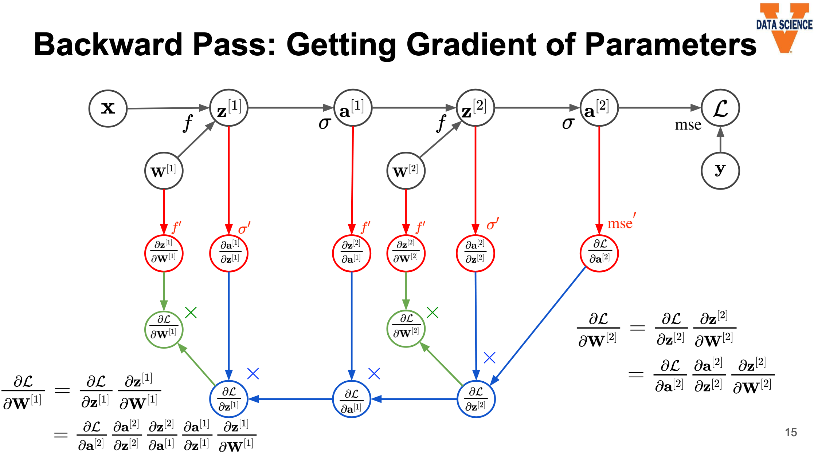

# Deep Feedforward Networks

Deep Learning Book [Ch. 6](https://www.deeplearningbook.org/contents/mlp.html)

- The goal of a FNN is to approximate some target function $f^*$ by defining a mapping $\boldsymbol{y} = f(\boldsymbol{x; \theta})$ and learning the best values of $\boldsymbol{\theta}$.
- Feedforward means that there is no feedback where outputs of the model are fed back into the model. Recurrent neural networks involve feedback.
- The network of a FNN comes from the chaining together of multiple functions, for example $f(\boldsymbol{x}) = f^{(3)}(f^{(2)}(f^{(1)}(\boldsymbol{x})))$, where $f^{(1)}$ is the first layer, $f^{(2)}$ is the second layer, etc.
  - The length of the chain (number of functions) is the **depth** of the model.
  - The final layer is called the **output layer**, and the other layers are **hidden layers**.
- Most neural networks calculate hidden layer features using the combination of an affine transformation (one that preserves lines and parallelism) and a nonlinear activation function.
  - Default activation function is rectified linear unit (ReLU), defined as $g(z) = \text{max}\{0, z\}$, a piecewise function with two linear pieces.
- For gradient-based optimization with FNNs, it is important to initialize all weights to small positive values and biases to zero or small positive values.
- Most neural nets are trained using maximum likelihood, with cost function of negative log-likelihood (equivalent to cross-entropy between training data and model distribution) $J(\theta) = -E_{x, y~\hat p_{data}} \text{log}p_{model}(\boldsymbol{y|x})$.
  - Negative log-likelihood helps to avoid the problem of saturation when functions become very flat, making the gradient very small.
- The choice of **output units** determines the form of the cross-entropy function. The output layer transforms hidden features into outputs relevant to the desired task.
  - Linear units are often used to produce the mean of a conditional Gaussian distribution. These units take input $\boldsymbol{h}$ and produce output $\boldsymbol{\hat{y}} = \boldsymbol{W^T h + b}$.
  - Sigmoid units can be used to produce a Bernoulli output. These units define output as $\hat y = \sigma(\boldsymbol{w^T h} + b)$.
  - Softmax units produce a probability distribution for multinomial output using $\boldsymbol{z} = \boldsymbol{W^T h + b}$, then $\text{softmax}(\boldsymbol{z})_i = \frac{\text{exp}(z_i)}{\sum_j\text{exp}(z_j)}$.
    - Squared error is a poor loss function for softmax units.
  - Neural nets with Gaussian mixtures as their outputs are called mixture density networks.
- ReLU units are the default choice for hidden units and usually work well. Choosing other types of units is a trial and error process.
  - When initializing the parameters of the affine transformation prior to a ReLU, it is good practice to set all elements of $\boldsymbol{b}$ to a small positive value (e.g. 0.1) to make it likely for the ReLUs to be active.
  - Generalized versions of ReLUs use a non-zero slope when $z_i < 0$: $h_i = \text{max}(0, z_i) + \alpha_i \text{min}(0, z_i)$. 
    - Absolute value rectification sets $\alpha_i = -1$ and is often used for image object recognition.
    - A leaky ReLU fixes $\alpha_i$ to a small value like 0.01.
    - A parametric ReLU (or PReLU) treats $\alpha_i$ as a learnable parameter.
    - Maxout units divide $\boldsymbol{z}$ into groups of $k$ values, then take the max of each group. Maxout units can learn to approximate any convex activation function.
    - Logistic sigmoid $g(z) = \sigma(z)$ and hyperbolic tangent $g(z) = \text{tanh}(z) = 2\sigma(2z)-1$. Discouraged in hidden layers because they saturate.
    - Linear hidden units can help reduce the number of parameters in a network.
- Designing neural nets involves choosing the number of layers (depth) and number of units per layer (width).
  - Deeper networks are usually able to use fewer units per layer and fewer parameters, but are harder to optimize. Shallow networks often require a number of hidden units that is exponential in $n$.
  - A deep architecture can be thought of as a general belief that the function we are trying to learn is made up of several simpler functions. Alternately, it can be a belief that the target function is a computer program that successively applies functions.
  - Choosing an architecture involves experimentation guided by validation error.
- In training a feedforward neural net, forward propagation involves the input flowing through the network to generate $\boldsymbol{\hat y}$ and calculate a scalar cost. Then, the **back-propagation** algorithm is used to compute the gradient from the cost.
  - Generally use dynamic programming and  initialize an array/table to store calculations to allow for re-use. This will speed computation time at the expense of memory.
- The **chain rule** tells us that we can calculate the gradient of a variable $\boldsymbol{x}$ when $\boldsymbol{y} = g(\boldsymbol{x})$ and $z = f(\boldsymbol{y})$ by $\Delta_{ \boldsymbol{x}}z = (\frac{\partial \boldsymbol{y}}{\partial \boldsymbol{x}})^T \Delta_{ \boldsymbol{y}}z$.
  - The Jacobian matrix $\frac{\partial \boldsymbol{y}}{\partial \boldsymbol{x}}$ and the gradient $\Delta_{\boldsymbol{y}}z$ are used.

### Video - Historical Perspective of Deep Learning

- Deep learning is a subset of representation learning, which is a subset of ML.
  - Deep learning maps input to output using abstract layers representing underlying features, sometimes with a hierarchy of multiple nested levels of abstract layers.
- Artificial neural networks are inspired by the brain, but are not realistic models of biological function.
- Deep learning was previously known as cybernetics (1940s-60s) and connectionism (1980s-90s).
  - Early CNN developed in 1998 by LeCun and used by USPS.
  - Two AI winters: first in 1970s when deep learning failed to live up to its promise; second in 1990s when training seemed too computationally expensive.

### Video - Components of Neural Networks

- An artificial **neuron** has one or more binary inputs and one binary output. Neurons can be combined into a network to perform logical computations (e.g. and/or).
- A LTU (linear threshold unit) consists of a weighted sum ($\boldsymbol{z} = \boldsymbol{w^T x} + b)$ and an activation threshold/step function ($\boldsymbol{a} = \phi(\boldsymbol{x})$).
  - $\boldsymbol{x}$ are the inputs and $\boldsymbol{w}$ are the weights, while $\boldsymbol{a} = \hat{y}$ are the outputs.
  - Similar to a neuron, but has numeric inputs/outputs.
- A **perceptron** is a simple neural net architecture consisting of a layer with LTU, and each neuron connected to all the input neurons (also usually including a bias neuron).
- A **multi-layer perceptron (MLP)** consists of one input layer, one or more hidden layers of LTUs, and one final output layer of LTU.
  - An MLP with 2+ hidden layers is a Deep Neural Network (DNN).
  - Notation in an MLP has superscripts indicating layer number and subscripts indicating node number, e.g. $z_2^{[3]}$ is the second node in the third layer.
  - The first layer is calculated from the input layer and weights, $\boldsymbol{Z}^{[1]} = \boldsymbol{W}^{[1]}\boldsymbol{X} + \boldsymbol{B}^{[1]}$, followed by the activation function $\boldsymbol{a}^{[1]} = \sigma(\boldsymbol{z}^{[1]})$.
    - $\boldsymbol{X}$ is a matrix of size $n^{[0]}\times m$, where m is the number of input examples in a training batch.
    - $\boldsymbol{Z}^{[l]}$ and $\boldsymbol{A}^{[l]}$ are a matrices of size $n^{[l]}\times m$, where $n^{[l]}$ is the number of nodes in hidden layer $l$.
    - $\boldsymbol{B}^{[l]}$ is $m$ replications of matrix $\boldsymbol{b}^{[l]}$. Can usually be accomplished with broadcasting in code.
    - $\boldsymbol{W}^{[l]}$ is a matrix of size $n^{[l]}\times n^{[l-1]}$, or the number of nodes in the current layer by the number of nodes in the previous layer.
- The activation function can be the step ($a=1$ if $z>0$ and $a=0$ otherwise), sigmoid ($a = \frac{1}{1 - e^z}$), tanh ($z = \frac{e^z - e^{-z}}{e^z + e^{-z}}$, or ReLU ($a = \text{max}(0, z)$, similar to hinge loss) functions, or another function.
  - The activation function is needed to create a non-linear transformation, giving us access to a deeper representation of the input data.
  - Step function doesn't work with gradient descent (derivative equal to zero). 
  - ReLU has a large & consistent derivative whenever it is active. Because it behaves similarly to linear, it is fast to compute and easy to optimize.
  - Sigmoid and hyperbolic tangent (tanh) saturate at 1. Training easier with tanh than sigmoid because it is similar to the identity function near 0.v
- The **softmax** function exponentiates and normalizes inputs to generate outputs summing to 1 (very useful for converting to probability of being assigned to a certain class).
  - $\text{softmax}(\boldsymbol{z})_i = \frac{\text{exp}(z_i)}{\sum_j \text{exp}z_j}$, where $z_i = \text{log}P(y = i | x)$
  - A "softened" version of argmax, which returns a one-hot encoded vector. Can be thought of as a generalization of the sigmoid function for binary variables to multivariate ones.
- Main considerations for neural network design are the depth of the network (number of layers) and width of each layer (number of nodes).
  - Deeper networks usually have fewer units per layer and are harder to optimize.
  - Ideal network architecture selected using experimentation guided by validation error.

### Video - Training Deep Neural Nets

- Four components: input data, layers, loss function (to define feedback signal used for training), optimizer.
- Loss function (aka cost, objective, or error function) is the quantity that will be minimized during training.
  - For regression, use MSE.
  - For classification, use cross-entropy (log loss).
- The optimizer is used to learn the network parameters that minimize the loss and determines how the network will be updated
  - Often some form of gradient descent.
- **Backpropagation** is one algorithm for training neural nets and consists of three steps:
  1. Forward pass: feed a training instance to the network, compute the output signal of every neuron, and measure the network error.
  2. Backward pass: measure (propagate) the error contributions of each neuron to the error from step 1. 
     - Requires taking partial derivatives and applying chain rule.
  3. Gradient descent: run gradient descent on all connection weights using the error from step 2.
- The chain rule is needed for symbol-to-symbol derivatives.
  - For example, to get $\frac{\partial z}{\partial w}$ when $z = f(y)$, $y = f(x)$, and $x = f(w)$, we can use the chain rule $\frac{\partial z}{\partial y}\frac{\partial y}{\partial x}\frac{\partial x}{\partial w}$.

- The full backprop algorithm is as follows:
  - Initialize network parameters/weights $\boldsymbol{W}^{[1]}$, $\boldsymbol{W}^{[2]}$, etc.
  - Repeat until convergence:
    - Forward pass to compute loss function $L(a^{[l]}, y)$
    - Backward pass to compute gradients $\frac {\partial L}{\partial \boldsymbol{W}^{[1]}}$, $\frac {\partial L}{\partial \boldsymbol{W}^{[2]}}$, etc.
    - Update network parameters $\boldsymbol{W}^{[l]} = \boldsymbol{W}^{[l]}  - \alpha \frac {\partial L}{\partial \boldsymbol{W}^{[l]}}$, etc.

- Tensorflow Neural Net [Playground](https://playground.tensorflow.org) lets you play around with layers/inputs/activation function/etc.

### Class Notes

*February 8, 2021*

- Overfitting occurs when E[test error] - E[training error] is large.

*February 15, 2021*

- FF networks and MLPs are general tools for arbitrary function estimation.
  - Computationally tractable with stochastic gradient descent but not gradient descent (due to large modern data sets).
- Universal approximation theorem: a FF network with at least one hidden layer with any "squashing" activation function can approximate any function to arbitrary accuracy.
- Kernel methods providing transformations into alternative feature spaces seem very flexible, but their predefined nature often does not provide the best generalization.
- Deep learning essentially tries to pass feature engineering from the human to the machine. Neural nets can consider far more feature transformations.
- Deeper networks encode a prior belief that composition of increasingly complex features captures relevant variation.