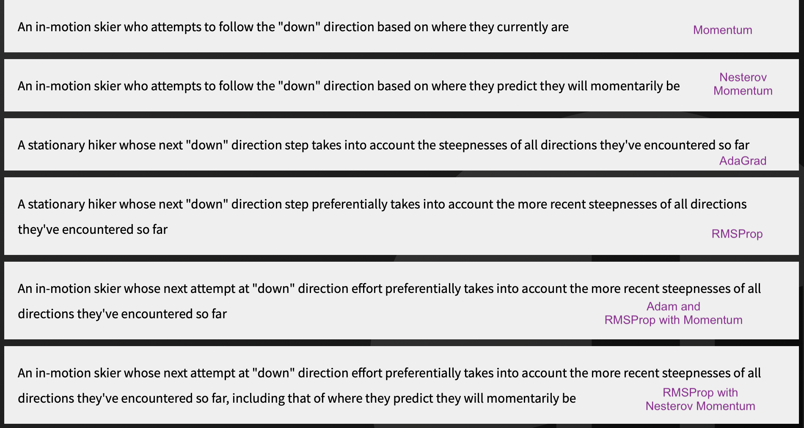

# Optimization

Reading: Deep Learning Book Ch. 8

- In machine learning, we are interested in minimizing the expected loss over the entire data-generating distribution $p_{\text{data}}$ rather than just over the finite training set. This expected generalization error is known as the **risk**.

  - **Empirical risk minimization** estimates the risk by minimizing the average training error, in the hope that the true risk will also decrease.

- Surrogate loss functions can be used when the desired loss function cannot be optimized efficiently.

  - E.g. negative log-likelihood instead of 0-1 classification loss.
  - Early stopping criteria typically based on true loss function rather than surrogate to prevent overfitting.

- Computing the expectation of the gradient is very expensive because it requires evaluating the model on every example in the dataset, so we instead randomly sample and average over those examples.

  - Most optimization algorithms converge much faster if allowed to compute approximations rather than the exact gradient.
  - Examples may be redundant or similar in their contributions to the gradient, in which case using all examples to calculate the exact gradient is not only inefficient but also unnecessary.

- **Batch** or deterministic algorithms use the entire training set.

- **Stochastic** or online algorithms use only a single example at a time.

  - Online describes those with streaming data rather than a large training set.

- **Minibatch** stochastic algorithms use a subset of the full training set.

  - Larger batches give more accurate estimates, but improvement is less than linear. 
  - Extremely small batches fail to benefit from multicore processors, so usually specify some absolute minimum batch size.
  - Batch size is limited by memory (the two scale linearly) if the entire batch is processed in parallel.
  - When using GPUs, runtime is better when batch size is a power of 2 (commonly 36 to 256, sometimes 16 for large models).
  - Smaller batches generally regularize the model more.
  - Methods that compute updates using only the gradient can use smaller batch sizes (~100), while those that use the Hessian need larger (~10,000).
  - Minibatches must be selected randomly so that each is independent.
    - If data ordered in some way, should shuffle first.
  - Stochastic gradient descent follows the gradient of the true generalization error as long as no examples are repeated.

- **Ill-conditioning** of the Hessian matrix is a problem that can impact even convex optimization problems, and causes SGD to get stuck where even small steps increase the cost function.

  - When this occurs, the gradient norm $\boldsymbol{g^Tg}$ increases over time, rather than decreasing as would be expected if the training process converged to a critical point.

- For convex functions, any local minima is also a global minimum, but neural nets are not convex and may have many local minima.

- **Weight space symmetry** describes models for which latent variables may be exchanged to produce equivalent models. This is one form of nonidentifiability.

  - Minima arising from nonidentifiability have equivalent cost function value, so they are not problematic. However, local minima with high cost compared to the global minimum are problematic.
  - Local minima are not believed to be a major problem for neural nets. Plotting the norm of the gradient over time can help rule out local minima as a problem. If the norm of the gradient does not shrink to insignificant size, local minima are not the problem.

- In higher-dimensional spaces, local minima are rare and saddle points are more common.

  - Critical points with low cost are more likely to be local minima than those with high cost, which are more likely to be saddle points or local maxima.
  - Gradient descent empirically seems able to escape saddle points in many cases.
  - Newton's method is susceptible to jumping to saddle points since it solves for where the gradient is zero. Second-order methods can avoid this but don't scale well to large networks.

- Cliffs are extremely steep regions where the gradient update step can move the parameters extremely far, and even "explode" them off of the cliff structure.

  - Can be avoided using gradient clipping heuristic which reduces step size.
  - Especially common in recurrent neural nets due to the multiplication of many factors.

- When the computational graph becomes very deep (in FFNs with many layers and in recurrent networks), optimization difficulties arise due to long-term dependencies.

  - When weight matrices are multiplied repeatedly, eigenvalues less than 1 vanish and those greater than 1 explode (as in cliffs).
  - This is more of a problem for recurrent networks than FFNs because they use the same weight matrix at every step.

- Optimization based on local downhill moves can fail if the local surface does not point toward the global solution, such as if the algorithm is initialized on the wrong side of a "mountain." In higher dimensions, algorithms can usually circumvent such peaks, but may take a long time to do so.

- Theoretical analysis of whether an optimization algorithm can reduce the value of a function sufficiently is very difficult.

- Stochastic gradient descent is the most-used algorithm both for deep learning and ML in general.

- Generally decrease the learning rate over time, with $\epsilon_k$ representing the learning rate at iteration $k$. Necessary because the random sampling of $m$ training examples introduces noise. 

  - Batch gradient descent can use a constant learning rate because it does not have this issue.

  - Common to decay the learning rate linearly until batch $\tau$, then leave it constant, updating by $\epsilon_k = (1-\alpha) \epsilon_0 + \alpha \epsilon_\tau$, where $\alpha = \frac{k}{\tau}$.
    - General guidelines: set $\tau$ high enough to make a few hundred passes through the training set; set $\epsilon_\tau$ to roughly 1% of $\epsilon_0$. Should monitor first ~100 iterations for the best learning rate, then set $\epsilon_0$ a little higher than that.

- The convergence rate of optimization algorithms can be measured by the excess error of the current cost function from the minimum possible value, $J(\boldsymbol{\theta}) - \text{min}_\theta J(\boldsymbol{\theta})$.

  - SGD has excess error $O(\frac{1}{\sqrt{k}})$ after $k$ iterations for convex problems and $O(\frac{1}{k})$ for strongly convex problems.
  - Cramer-Rao bound states that generalization error can't decrease faster than $O(\frac{1}{k})$.

- Momentum is a modification to the SGD optimization algorithm that aims to overcome poor conditioning of the Hessian matrix and variance in the stochastic gradient.

  - Designed to accelerate learning when there is high curvature, small but consistent gradients, or noisy gradients. In a canyon, it can avoid moving inefficiently back and forth across the canyon and instead move more lengthwise.
  - Uses velocity (defined as exponentially decaying average of the negative gradient) to update the parameters, $\boldsymbol{\theta} \leftarrow \boldsymbol{\theta + v}$.
    - Because we assume unit mass, velocity = momentum.
  - Velocity updated after gradient estimate $\boldsymbol{v} \leftarrow \alpha \boldsymbol{v} - \epsilon\boldsymbol{g}$. The larger $\alpha$ is in relation to $\epsilon$, the more previous gradients affect the current direction. 
    - Step size is largest when many successive gradients point in the same direction.
    - Terminal velocity step size is $\frac{\epsilon ||\boldsymbol{g}||}{1-\alpha}$. Momentum hyperparameter $\alpha$ controls maximum speed - $\alpha = 0.9$ multiplies maximum speed by 10 relative to gradient descent.
  - Common values of $\alpha$ are 0.5, 0.9, and 0.99.

- Nesterov momentum is a modification that applies a corrective factor to the standard momentum algorithm. It evaluates the gradient after the current velocity is applied.

- Most algorithms for training deep learning models are strongly impacted by initialization point.

  - Initial parameters need to break symmetry between different units (if two hidden units have the same activation function and same inputs, they must have different initial parameters or else they will constantly update both units in the same way).
  - Almost always initialize all weights in a model as random draws from a Gaussian or uniform distribution.
  - Large weights in recurrent networks can lead to exploding values or chaos.
  - When enough computing power is available, it is best to make the initial scale of the weights a hyperparameter and use a hyperparameter search algorithm to select the best start values.

- Initializing the biases to zero is compatible with most weight initialization strategies.

  - Sometimes want to set biases for ReLUs to 0.1 instead of 0 to avoid beginning with saturation. Not recommended with random walk initialization.

- Adaptive learning rate algorithms attempt to use a separate learning rate for each parameter and automatically adapt these rates during learning.

  - AdaGrad adapts the learning rate of all parameters by scaling them inversely to the square root of the sum of all historic squared values of the gradient. Works well for some but not all models.
  - RMSProp uses an exponentially weighted moving average of gradient accumulation. Performs better than AdaGrad in nonconvex settings.
    - Hyperparameter $\rho$ controls length scale of moving average.
  - Adam (adaptive moments) is similar to a combination of RMSProp and momentum. Momentum is incorporated directly as an estimate of the first-order moment. Includes bias corrections to estimates of both first-order moments (momentum) and second-order moments.

- Newton's method is an optimization approach based on using a second-order Taylor series expansion to approximate $J(\boldsymbol{\theta})$.

  - For a locally quadratic function, will jump immediately to the minimum. 
  - For convex but not quadratic functions, an iterative approach can be used by updating the inverse Hessian (quadratic optimization), then updating the parameters by $\boldsymbol{\theta}^* = \boldsymbol{\theta}_0 - [H(f(\boldsymbol{\theta}_0)) + \alpha \boldsymbol{I}]^{-1}$. 
    - Used in Levenberg-Marquardt algorithm.
  - Computationally complex ($O(k^3)$ for $k$ parameters) due to calculation of inverse Hessian.

- Conjugate gradients avoids calculating inverse Hessian and descends conjugate gradients rather than steepest descent.

  - In steepest descent, each line search direction is orthogonal to the previous at the minimum of the objective along a given direction.
  - The next direction is defined as $\boldsymbol{d}_t = \Delta_\theta J(\boldsymbol{theta}) + \beta_t \boldsymbol{d}_{t-1}$, where $\beta_t$ is a coefficient that determines how much of the previous direction we should add back to the current direction. Two directions are conjugate if $\boldsymbol{d}_t^T \boldsymbol{H d}_{t-1} = 0$.
  - Stays along the minimum of previous directions to avoid undoing previous progress.
  - Nonlinear conjugate gradients algorithm can be used to train neural nets.

- Broyden-Fletcher-Goldfarb-Shanno (BFGS) algorithm also tries to mimic Newton's method without the high computational cost.

  - Impractical for deep learning models with many parameters, because storing the Hessian approximation takes $O(n^2)$ memory.

- **Batch normalization** is an optimization method (not an algorithm) of adaptive reparameterization.

  - Helps prevent simultaneous updates of layers from having unexpected results.
  - Reparameterizes any input or hidden layer in a network by normalizing $\boldsymbol{H}$ (a minibatch of activations of the layer) by replacing it with $\boldsymbol{H}' = \frac{\boldsymbol{H - \mu}}{\boldsymbol{\sigma}}$, where $\boldsymbol{\mu}$ contains the mean of each unit and $\boldsymbol{\sigma}$ contains the standard deviation of each unit.
  - To maintain the expressive power of the network (which can be limited by normalizing), it is common to use $\boldsymbol{\gamma H' + \beta}$ instead of $\boldsymbol{H'}$.
  - Recommended to apply to output of nonlinear activation function instead of to input.

- Coordinate descent involves minimizing a function with respect to one variable, then with respect to another, cycling through all variables. Guaranteed to reach a local minimum.

  - Block coordinate descent minimizes with respect to a subset of variables at once.
  - Not a good strategy when the value of one variable strongly influences the optimal value of another.

- Polyak averaging involves averaging several points (usually an exponentially decaying running average) in the trajectory through parameter space visited by an optimization algorithm.

  - In theory, should produce a value close to the bottom of a valley, while the optimization algorithm could leap across the valley without touching the bottom.

- Supervised pertaining involves training simple models on simple tasks before training it to perform the desired task.

  - Greedy algorithms break a problem into subproblems, solve each, and combine the results. Not guaranteed to be optimal, but computationally cheaper and often acceptible solutions.
  - Greedy supervised pretraining breaks supervised learning problems into smaller supervised problems and applies a greedy approach.
    - One approach pretrains one layer at a time.

- In general, it is more important to choose a model family that is easy to optimize than to use a powerful optimization algorithm.

- Continuation methods make optimization easier by choosing initial points to ensure that local optimization spends most of its time in well-behaved regions of space.

  - Construct easier cost functions by "blurring" the original cost function. Designed to reach global minimum even with many local minima.
    - Fails when blurring doesn't make function convex.
  - Can also help eliminate flat regions, decrease variance in gradient estimates, or improve conditioning of the Hessian.
  - Curriculum learning is a continuation method that plans a learning process to learn simple concepts and progress to more complex concepts that depend on the simpler ones.

### Video - Initialization, Activation, & Normalization

- Empirical risk minimization tries to minimize the expected loss on the training set. Optimize empirical risk in hope that overall risk decreases as well.
- Choice of minibatch size depends on hardware, parallelism, and memory. 
  - Common to choose power of 2 batch sizes (32-256).
  - Minibatches must be selected randomly.
- Local minima with high cost can be a serious problem for gradient-based optimization. 
- Saddle points are common in high-dimensional non-convex functions. Some points around a saddle have higher cost and some have lower.
- Complex problems require deep networks, but training will be slow, overfitting can occur due to millions of params, and "vanishing gradients" can be an issue.
  - Vanishing gradients occur in deep computational graphs when the same operation is applied repeatedly, causing the gradient to get smaller and smaller.
  - Exploding gradient problem is reverse, when gradient gets larger and larger, causing the network to become unstable.
- **Initialization**: how to initialize weights so they do not saturate? Deep learning is strongly affected by initialization.
  - To avoid vanishing, exploding, and saturating, we want to break symmetry between different units. Xavier initialization does this by using $\boldsymbol{W}_{i, j}$ ~ $\text{Uniform}(-\sqrt\frac{6}{n_{inputs} + n_{outputs}}, \sqrt\frac{6}{n_{inputs} + n_{outputs}})$ or $\boldsymbol{W}_{i, j}$ ~ $N(0, \sqrt\frac{2}{n_{inputs} + n_{outputs}})$
    - Uses heuristic that variance of outputs of each layer should be same as variance of its inputs.
  - He initialization multiplies the Xavier initialization parameters by 4 for hyperbolic tangent activation function and by $\sqrt{2}$ for ReLU.
  - Controlled by `kernel_initializer` param in `keras.layers.Dense`.
- **Activation**: how to solve vanishing gradient problem?
  - Sigmoid function saturates, so other functions like ReLU often perform much better.
  - ReLU fast to compute, but can "die" when it outputs 0. Leaky ReLU addresses this by having slight negative slope when less 0.
  - ELU (exponential linear unit) converges faster than ReLU. Avoids dead neurons.
    - Similar to leaky ReLU, but smooth exponential curve when less than 0 ($\alpha(\text{exp}(z) - 1)$ for $z < 0$). Means it is differentiable at 0.
    - Specified by `activation = 'selu'` in keras.
- **Normalization**: how to get model to learn optimal scale?
  - Batch normalization adds an operation (normalizing) before the activation function. Puts inputs on optimal scale.
    - Tries to learn scale, offset, mean, and standard deviation for each node.
    - In keras, can put `keras.layers.BatchNormalization()` before each Dense layer.
  - Gradient clipping is a "quick and dirty" alternative to batch normalization. Clips gradients during backpropagation so that they can never exceed some threshold.
    - Often used in Recurrent Neural Nets.

### Video - Optimizers, Adaptive Learning Rates, & Second-Order Methods

- **Optimizers**: what to do when gradient descent is too slow or not good enough?
  - Momentum optimization accumulates past gradients and continues to move in their direction to accelerate the learning.
    - Nesterov momentum evaluates the gradient *after* the current momentum is applied (instead of before in regular momentum). Update parameters, *then* evaluate gradient.
- **Adaptive Learning Rate**: what if convergence is too slow or sub-optimal?
  - Adaptive learning rates introduce a hyperparameter $\alpha$ to offset the problem of  a loss function being highly sensitive in some directions of parameter space and insensitive to others. Also addresses the issue of learning rate $\epsilon$ being one of the most difficult hyperparameters to set.
    - AdaGrad individually adapts the learning rates of all model parameters. Scales them inversely proportional to sum of all previous squared gradient values. Won't go too fast in steep areas or too slow in shallow areas.
    - RMSProp is like AdaGrad, but discards history from extreme past to avoid scaling down the learning rate too fast. Exponential decay $\beta$ (`rho` in keras) typically set to 0.9.
    - Adam (Adaptive Moment Estimation): like momentum, keeps track of exponentially decaying moving average of past gradients, and like RMSProp, keeps track of exponentially decaying moving average of past squared gradients.
  - No consensus on which algorithm is best, depends largely on user's familiarity with algorithm and ability to tune.
- **Second-Order Training Methods**: can we make use of second derivatives?
  - SGD, momentum, and Adam are all first-order optimization methods (use only the gradient).
  - Hessian = Jacobian of gradient function (contains second derivatives).
  - Newton's method (most widely-used second-order method) is based on a Taylor series expansion.
    - $J(\theta) \approx J(\theta_0) + (\theta - \theta_0)^T \boldsymbol{g} + \frac{1}{2}(\theta - \theta_0)^T \boldsymbol{H}(\theta - \theta_0)$: first term is previous value of loss function, second is expected improvement due to the slope, third is correction applied to account for curvature.
    - Solve for critical point of $J(\theta)$ (using inverse Hessian) to jump directly to a critical point. Works for convex quadratic functions immediately, convex functions iteratively, but not as well for non-convex functions (with saddle points).
    - Inverting Hessian is computationally expensive, so only practical for small networks.
  - Conjugate gradients method avoids calculation of inverse Hessian and instead iteratively descends conjugate directions.
    - In $k$-dimensional parameter space, reaches minimum in at most $k$ line searches.
  - BFGS algorithm is a quasi-Newton method that approximates the inverse of the Hessian using iterative refinement by low-rank updates.
    - Requires storing approx. inverse Hessian matrix $\boldsymbol{M}$, which requires $O(n^2$) memory, so not practical for large networks with millions of params.

### Class Notes

*March 3, 2021*

- Numerically unstable: can come from high condition number of matrix (small change to number multiplied by matrix leads to large change in result). Unstable gradient: vanishing or exploding.
- Using minibatch can provide some regularization by having a (possibly) different gradient each time.
  - Small batches can offer a regularizing effect because they add noise to the random samples. This is similar intuition as with dropout regularization.
- SGD means that larger data doesn't slow optimization.
- Appropriately scaling weight initializations biases against vanishing or exploding activations. Randomly initializing weights helps create a variety of different activation functions.
- If distribution of activations at each layer is changing rapidly, increasing/decreasing the scale of weight parameter initialization could help. 
  - Similarly, if distribution of gradients at each backprop layer is very small, increasing scale of weight parameter could help.
- Batch normalization causes weight changes in previous layers to not change the scale of batch normalization layer activations, which in turn causes the weights coming into the batch normalization layer to not be so affected by changes in weights of previous layers.
- Nesterov momentum is basically a one-step ahead prediction of where it will momentarily be.
- AdaGrad accumulates gradient from all time, which becomes less useful as training goes on. Learning rate is an inverse, so learning rate gets very very small, and it stops moving. AdaDelta and RMSProp have a short-term memory (exponentially decaying average).
  - AdaGrad has no notion of momentum - interested in shape of function it is traversing, while momentum is interested in current speed.
  - AdaGrad increases (not decreases) the learning rate of parameters that yield small partial derivative w.r.t loss.
- In Adam, momentum corresponds to the first derivative and adaptive learning rate is the second derivative.

- Momentum = in-motion skier because. *they're already in motion sliding along and building up that speed so that's going to affect how they actually change directions based on the current gradient calculated at a given instant/SGD step*.
  - Nesterov momentum is **based on where they predict they will momentarily be** *not where they currently are* (like regular momentum).
  - AdaGrad and RMSProp = stationary hikers because *they're not building up speed (like a "skier") but just following the gradient at each step.*
  - AdaGrad goes faster on the shallower slopes, and SLOWER on the steep slopes by speeding up the learning rates on the axes with more shallow slopes.
  - RMSProp/AdaDelta differ from AdaGrad in that they take into account recent steepness rather than all gradient history. Both keep the idea of going faster on shallower slopes and slower on steep slopes.